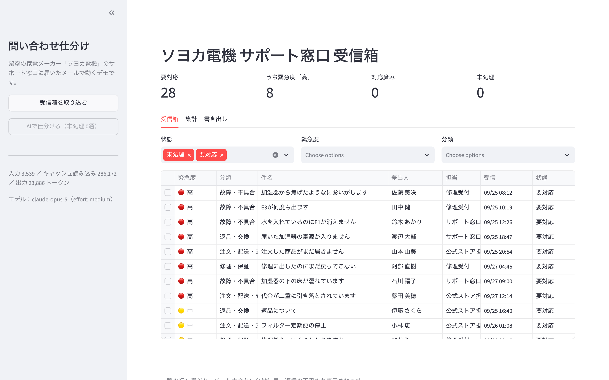
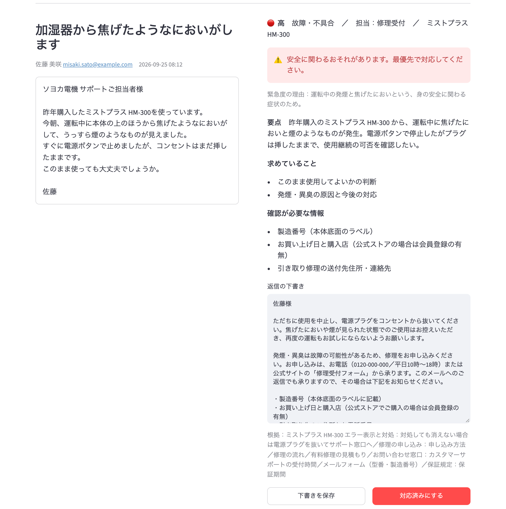
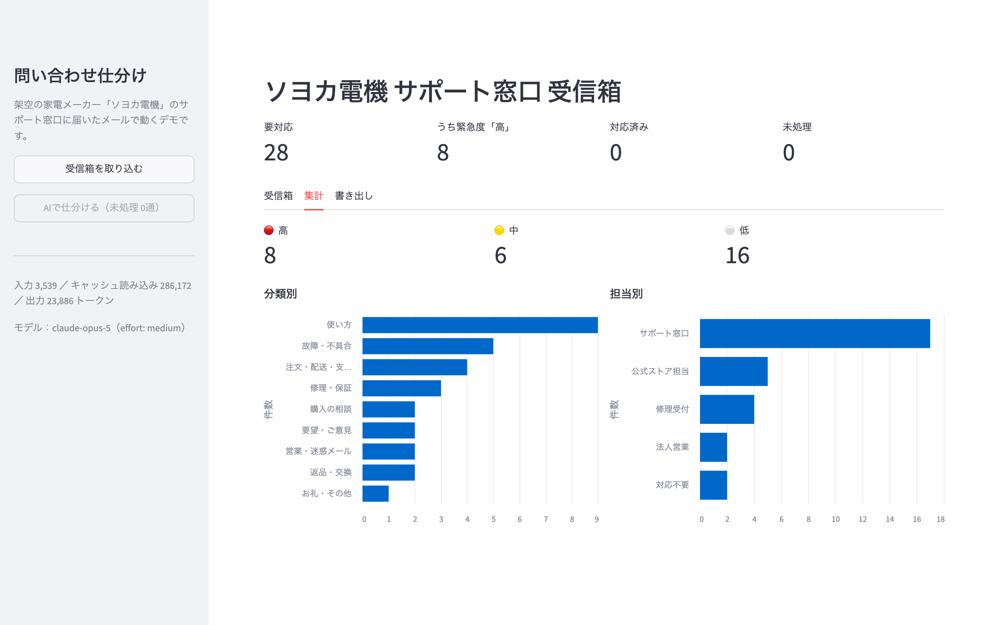
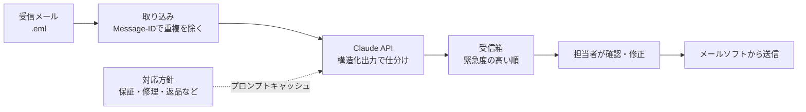

# 問い合わせメール仕分けAI

サポート窓口に届く問い合わせメールを、AIが**分類・緊急度・担当**に仕分け、**返信の下書き**まで用意します。
担当者は、緊急度の高い順に並んだ一覧から下書きを確認・修正して送るだけで済みます。メールの自動送信はしません。

> 題材は架空の家電メーカー「ソヨカ電機」です。メール・人物・会社はすべてデモ用に作成したもので、実在のものとは関係ありません。
> 同じ会社の製品サポートチャット：[support-faq-rag](https://github.com/gishi-dev/support-faq-rag)



| 1通ごとの仕分け結果と返信の下書き | 分類・担当ごとの集計 |
|---|---|
|  |  |

## 減らせる作業

- **読んで振り分ける作業**：メールを開いて内容を読み、誰が対応するかを決める作業をAIが先に済ませます。
- **急ぎの見落とし**：発煙や水漏れなど安全に関わるもの、二重請求、約束の期日を過ぎた苦情は「高」として一覧の先頭に出ます。
- **返信を一から書く作業**：社内の対応方針（保証規定・修理の流れ・返品条件など）に沿った下書きを用意します。足りない情報（製造番号・注文番号など）も、何を尋ねればよいかまで書き出します。
- **集計と共有**：分類・担当ごとの件数を確認でき、CSVでExcelやスプレッドシートに書き出せます。

## 1通ごとに判定する内容

| 項目 | 内容 |
|---|---|
| 分類 | 故障・不具合／修理・保証／返品・交換／注文・配送・支払い／使い方／要望・ご意見／購入の相談／お礼・その他／営業・迷惑メール |
| 緊急度 | 高・中・低と、その理由 |
| 担当 | サポート窓口／修理受付／公式ストア担当／法人営業／対応不要 |
| 要点 | 問い合わせの要約、お客様が求めていること、確認が必要な情報 |
| 安全 | 発煙・異臭・水漏れなど、身の安全に関わるおそれ |
| 返信の下書き | 対応方針に沿った本文と、根拠にした資料名 |

## 仕組み



- **構造化出力**：判定結果は、決められた項目と選択肢の形で受け取ります（Claude APIの構造化出力とPydantic）。分類名の表記ゆれや項目の抜けが起きず、そのまま絞り込みや集計に使えます。
- **プロンプトキャッシュ**：対応方針（約1万トークン）は全メールで同じなので、キャッシュに載せて2通目以降の入力費用を下げています。30通のデモでは、29通分をキャッシュから読み込みました。
- **重複防止**：同じメールは何度取り込んでも1件のままです。仕分け済みのメールを二度仕分けることもありません。
- **人が最後に確認**：返信は下書きまでで、送信は担当者が行います。

## 返信の下書きで守らせていること

- 対応方針に書かれていない料金・日数・対応（返金の確約など）を作らない。
- 修理の進み具合や請求の状況など、社内で確認が必要なことは推測しない。
- 苦情では、状況を確認して連絡することを中心に書く。連絡の期限は担当者が決める（下書きでは【連絡期限】として残す）。
- カード番号などの決済情報は、メールで尋ねない。
- 迷惑メールには返信を作らず、フィッシングの疑いを要点に書く。
- 英語のメールには英語で返信する。

## 動かし方

Python 3.10以降が必要です。

```bash
git clone https://github.com/gishi-dev/inquiry-triage.git
cd inquiry-triage
python3 -m venv .venv
source .venv/bin/activate
pip install -r requirements.txt
cp .env.example .env   # ANTHROPIC_API_KEY を設定する
streamlit run app.py
```

画面左の「受信箱を取り込む」で `inbox/` のメール30通を登録し、「AIで仕分ける」で仕分けます。30通の仕分けにかかる費用は、既定の設定で1ドル前後です。

## ファイル構成

| ファイル | 役割 |
|---|---|
| `app.py` | 画面（受信箱、集計、書き出し） |
| `triage/inbox.py` | .emlファイルの読み込み |
| `triage/classify.py` | 仕分けの指示と判定項目、Claude APIの呼び出し |
| `triage/store.py` | メールと仕分け結果の保存（SQLite） |
| `inbox/` | 架空の問い合わせメール（30通） |
| `knowledge/` | 返信の根拠にする対応方針（架空の製品資料） |

## 実際の業務で使うには

- **メールの取り込み**：`inbox/` の代わりに、Gmail API やIMAPで受信箱から新着メールを取得します。Message-IDでの重複防止はそのまま使えます。
- **記録先**：SQLiteの代わりに、Googleスプレッドシートやkintone、既存のサポートツールへ書き込みます。
- **対応方針**：`knowledge/` を自社の規定やFAQに入れ替え、`triage/classify.py` の分類・担当を自社の体制に合わせます。
- **送信**：下書きをメールソフトの下書きフォルダへ保存する形にすると、担当者は確認して送るだけになります。

## 設定

| 名前 | 既定値 | 内容 |
|---|---|---|
| `ANTHROPIC_API_KEY` | （必須） | Claude APIのキー |
| `TRIAGE_MODEL` | `claude-opus-5` | 仕分けに使うモデル |
| `TRIAGE_EFFORT` | `medium` | 考える深さ（`low`〜`max`） |
| `TRIAGE_INBOX_DIR` | `inbox` | 取り込むメールのフォルダ |

## ライセンス

[MIT License](LICENSE)
